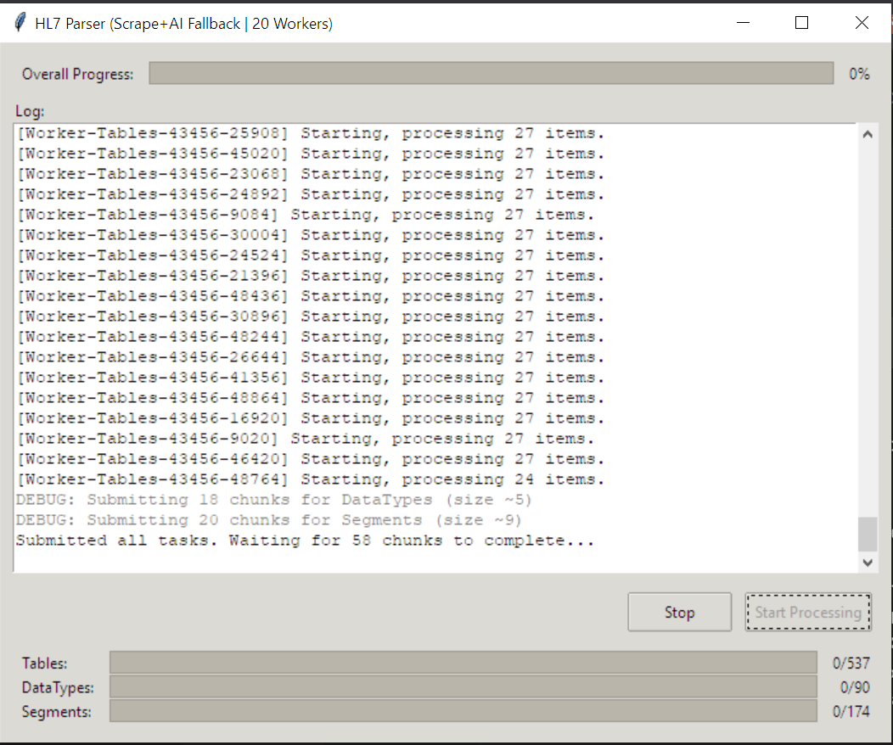

# HL7 v2.6 Definition Scraper and Comparator

## Overview

This project scrapes HL7 v2.6 definition data (Tables, DataTypes, Segments) from the Caristix definition website (`https://hl7-definition.caristix.com/v2/HL7v2.6`). It uses Selenium for web scraping and Google Gemini AI (via the `google-generativeai` library) as a fallback mechanism to parse page content when direct scraping fails or returns incomplete data.

The application features a Tkinter-based graphical user interface (GUI) to start/stop the process and view logs and progress. It utilizes multi-threading (`concurrent.futures.ThreadPoolExecutor`) to process definitions concurrently for faster execution.

Scraped and parsed data is cached and merged into a single JSON output file (`hl7_definitions_v2.6.json`). After generation, the script automatically runs a comparison against a reference JSON file (`comparison_files/HL7_TEST_2.6.json`) using `hl7_comparison.py` and reports any differences found.

## Features

*   **Web Scraping:** Uses Selenium and ChromeDriver (managed by `webdriver-manager`) to scrape HL7 definitions.
*   **AI Fallback:** Leverages Google Gemini (specifically `gemini-1.5-flash`) to parse HTML source code when direct scraping is unsuccessful.
*   **Concurrency:** Employs `ThreadPoolExecutor` to run multiple scraping/parsing tasks in parallel (configurable via `MAX_WORKERS`).
*   **GUI:** Provides a user-friendly interface built with Tkinter for control and monitoring.
*   **Caching:** Loads existing definitions from the output JSON file to avoid re-processing already scraped items.
*   **Comparison:** Includes a script to compare the generated definitions against a reference file, highlighting discrepancies.
*   **Metadata Tagging:** Injects a temporary `_original_type` tag during processing to ensure accurate logging ("DataType" vs. "Segment") during comparison, even though both are stored under the `dataTypes` key in the final output.


## Running the code 
The main piece of code to run is the main4.py. Simply running it as ```python main4.py``` (Windows) or ```python3 main4.py``` (UNIX). 
This will run the code and create a gui for you to 'Start' or 'Stop' the processing. 

The code will be created in the same folder. 

Batch size, version number, carsix link, etc. can be found at the top of the main4 file.
Needed install libraries are present in the requirements as well. 
use your own API_KEY (copy and paste into ```api_key.txt```)
The code should take some time to run. Delete the generated JSON before running once more.
Test JSON (to compare against the generated JSON) should be placed in the comparison files folder (an example has been placed in the HL7_test_2.6.json)

Ctrl + C ends the program midway (CLI), or clicking 'STOP'

## File Structure & Key Components

```text
.
├── __pycache__/            # Python bytecode cache (auto-generated)
├── comparison_files/
│   └── HL7_TEST_2.6.json   # Reference/Ground Truth JSON file for comparison
├── fallback_html/          # Directory to store HTML source for AI fallback debugging
├── screenshots_gui_hybrid/ # (Potentially legacy) Directory for screenshots
├── api_key.txt             # File containing the Google AI (Gemini) API Key (MUST BE CREATED)
├── hl7_comparison.py       # Python script for comparing generated JSON vs reference JSON
├── hl7_definitions_v2.6.json # Main output file containing scraped/parsed definitions
├── main.py                 # Older version? (Assumes main4.py is current)
├── main2.py                # Older version?
├── main3.py                # Older version?
├── main4.py                # <<< CURRENT MAIN APPLICATION SCRIPT >>>
├── pip_install_libraries.txt # (Alternative name) List of dependencies
├── README.md               # This file
└── requirements.txt        # Standard file listing Python dependencies
```
## Files

*   **`main4.py`**:
    *   The main executable script for the application.
    *   Contains the `HL7ParserApp` class which builds the Tkinter GUI.
    *   Includes the `run_parser_orchestrator` method, which manages the overall workflow using `ThreadPoolExecutor`.
    *   Defines the `process_definition_chunk_thread` function executed by worker threads. This function handles scraping/AI fallback for a chunk of definitions and adds the `_original_type` metadata tag.
    *   Contains Selenium setup (`setup_driver`), list fetching (`get_definition_list`), scraping logic (`scrape_...`), Gemini interaction (`analyze_..._html_with_gemini`), and utility functions.
    *   Handles status updates to the GUI via a `queue.Queue`.
    *   Initiates the final comparison by importing and calling `hl7_comparison.py`.

*   **`hl7_comparison.py`**:
    *   A script designed to compare two HL7 definition JSON files: the one generated by `main4.py` and a reference file.
    *   Can be run standalone or imported by `main4.py`.
    *   Contains functions to load JSON (`load_json_file`), compare lists (`compare_lists_detailed`), compare definition structures (`compare_definition_structure`), and compare individual fields (`compare_field_part`).
    *   Uses the `_original_type` tag (if present in the generated data) to correctly label log messages as "DataType" or "Segment".
    *   Reports missing/extra items and detailed attribute mismatches to the status queue (if provided) or console.

*   **`comparison_files/HL7_TEST_2.6.json`**:
    *   This is the **reference file** used by `hl7_comparison.py`.
    *   It represents the expected "correct" structure and content for the HL7 v2.6 definitions.
    *   **Crucially, its format must align precisely with the intended output format of `main4.py`** (including camelCase names, standard HL7 types, the presence/absence of the `hl7SegmentName` part in segments, etc.) for the comparison results to be meaningful. If the generator's output is considered the standard, this file must be updated to match it.

*   **`hl7_definitions_v2.6.json`**:
    *   The primary output file generated by `main4.py`.
    *   Stores the collected definitions in JSON format.
    *   Contains top-level keys: `tables`, `dataTypes`, and `HL7`.
    *   The `dataTypes` key contains *both* actual HL7 DataTypes and HL7 Segments, merged during the final processing step.
    *   This file acts as a cache; definitions present here might be skipped on subsequent runs.

*   **`api_key.txt`**:
    *   A **required** configuration file.
    *   Must contain your Google AI (Gemini) API key on the first line, with no extra characters or lines.
    *   **Security Note:** This file contains sensitive credentials. Ensure it is **added to your `.gitignore` file** to prevent accidental commits.

*   **`fallback_html/`**:
    *   A directory automatically created by `main4.py`.
    *   When direct scraping fails for a definition page and the AI fallback is triggered, the raw HTML source of that page is saved here (e.g., `DataTypes_XCN_fallback.html`).
    *   This is useful for debugging why scraping might have failed or how the AI interpreted the HTML.
    *   This directory is automatically cleared after a successful run completes *without any errors*. It is kept if errors occur or if the process is stopped manually.

*   **`requirements.txt`** (or `pip_install_libraries.txt`):
    *   Lists the Python packages required to run the project.
    *   Use `pip install -r requirements.txt` to install dependencies.

## Setup & Installation

1.  **Clone/Download:** Get the project files.
2.  **Python:** Ensure you have Python installed (developed with 3.x, e.g., 3.9+ recommended).
3.  **Chrome:** Ensure Google Chrome browser is installed. `webdriver-manager` will attempt to download the correct ChromeDriver.
4.  **Virtual Environment (Recommended):**
    ```bash
    python -m venv venv
    source venv/bin/activate  # Linux/macOS
    # or
    venv\Scripts\activate    # Windows
    ```
5.  **Install Dependencies:**
    ```bash
    pip install -r requirements.txt
    ```
    *(If using `pip_install_libraries.txt`, use that filename instead).*

## Configuration

1.  **API Key:**
    *   Create a file named `api_key.txt` in the same directory as `main4.py`.
    *   Open the file and paste **only** your Google AI (Gemini) API key into it. Save the file.
    *   Add `api_key.txt` to your `.gitignore` file.
2.  **Reference File:**
    *   Ensure the `comparison_files/HL7_TEST_2.6.json` file exists.
    *   Verify its structure and content match the **expected output format** of the generator (`main4.py`) for accurate comparison.

## Usage

1.  Activate your virtual environment (if used).
2.  Run the main script:
    ```bash
    python main4.py
    ```
3.  The GUI window will appear.
4.  Click the "Start Processing" button.
5.  Observe the progress bars and the log area for status updates, warnings, and errors.
6.  The process will involve:
    *   Loading cached definitions.
    *   Fetching definition lists (Tables, DataTypes, Segments).
    *   Launching multiple worker threads to process definitions (scraping or AI fallback).
    *   Merging new results with cached data.
    *   Saving the updated `hl7_definitions_v2.6.json`.
    *   Running the comparison against `comparison_files/HL7_TEST_2.6.json`.
    *   Displaying a completion message (success or with errors).
7.  Click "Stop" to gracefully attempt to halt the process (may take a moment for threads to respond).

## Dependencies (Example `requirements.txt`)
selenium>=4.0.0
webdriver-manager>=4.0.0
google-generativeai>=0.4.0
Pillow>=9.0.0
(tkinter is usually included with Python standard library)

